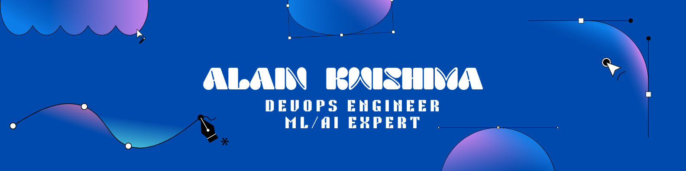
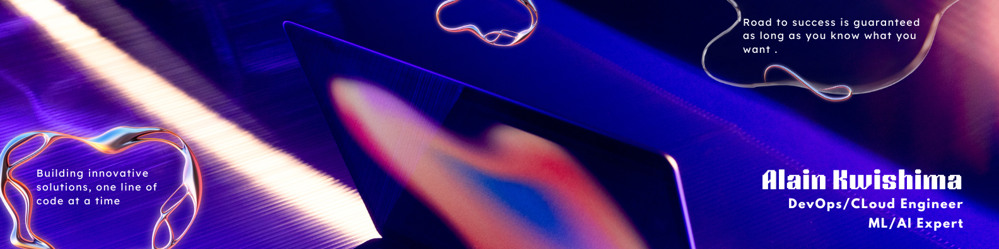

# 
🚀 **Alain Kwishima**

  
[]

  
<strong>Hey there!</strong> 👋 I'm a passionate <strong>DevOps Engineer </strong>and <strong>AI/ML Expert</strong> on a mission to automate everything and scale cloud infrastructures efficiently.

 

## 💫 About Me

<table>
<tr>
<td width="50%">

### What I Do
- 🌩️ **Cloud & DevOps Specialist**
  - Architecting scalable infrastructures
  - AWS, Azure, Kubernetes expert
- 🤖 **AI & ML Expert**  
  - Machine Learning and AI enthusiast and Expert
  - python/DJango specialist
  - Model Training 
- 🤖 **Automation Enthusiast**
  - CI/CD pipelines
  - Infrastructure as Code (IaC)

</td>
</tr>
</table>

## 🌐 DevOps Learning Hub

> 
>
> Empowering DevOps & Cloud Learners — One Resource at a Time with the inclusion of AI and Machine Learning

<table>
<tr>
<td width="50%">

</td>

### 🎯 Our Mission
DevOps knowledge should be accessible to everyone. We believe in:
- 🔓 Breaking down paywalls
- 🛠️ Learning by building
- 🤝 Community-driven growth
- 📈 Continuous improvement
- 🌟 Practical experience

</td>
</tr>
</table>

<table>
<tr>

<td width="50%">

### 🔧 Tools & Guides
- [CI/CD Pipeline for AWS EKS](https://github.com/NotHarshhaa/CI-CD_EKS-GitHub_Actions.git)
- [DevOps Tool Installer](https://github.com/NotHarshhaa/DevOps-Tool-Installer)
- [Azure DevOps Guide](https://github.com/NotHarshhaa/azure-all_in_one.git)
- [DevOps Cheatsheet](https://github.com/NotHarshhaa/devops-cheatsheet)

</td>
</tr>
</table>

## 📝 Latest Blog Posts

<table>
<tr>
<td>

### 📌 Dev.to Articles

</td>

</tr>
</table>

## ⚡ Tech Stack

### Cloud & Platforms

### DevOps & CI/CD

### Containers & Orchestration

### Infrastructure & Monitoring

## 📊 GitHub Stats

  
  

## 💝 Support My Work

> If you find my work valuable, consider supporting me! Your support helps create more DevOps content and projects.

---

